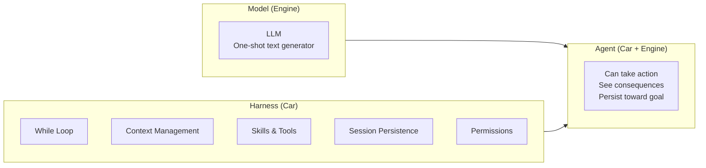
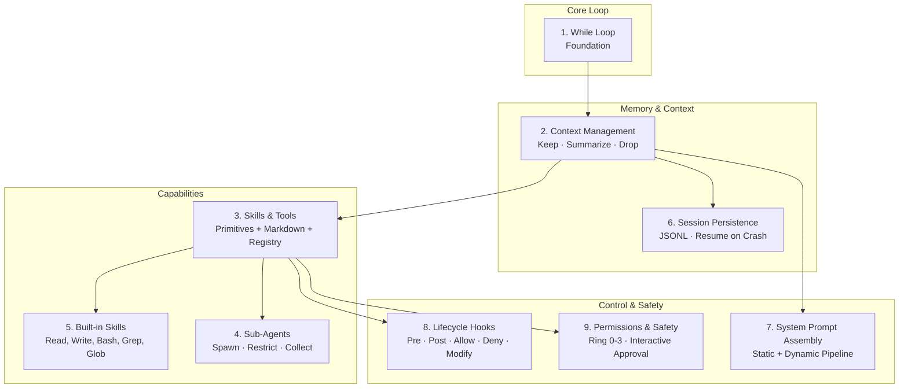
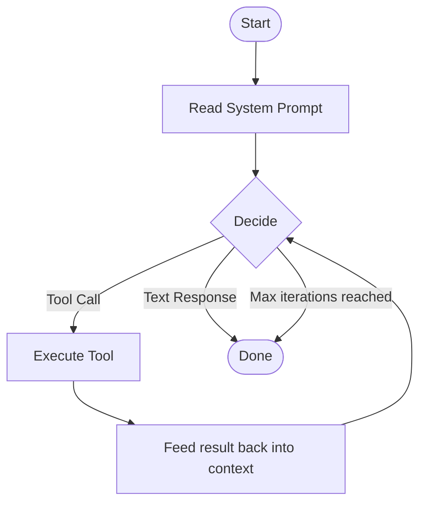
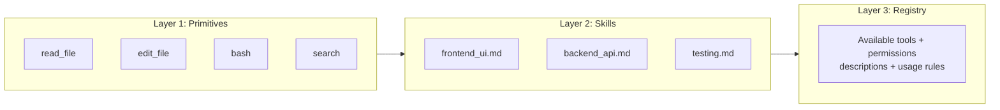
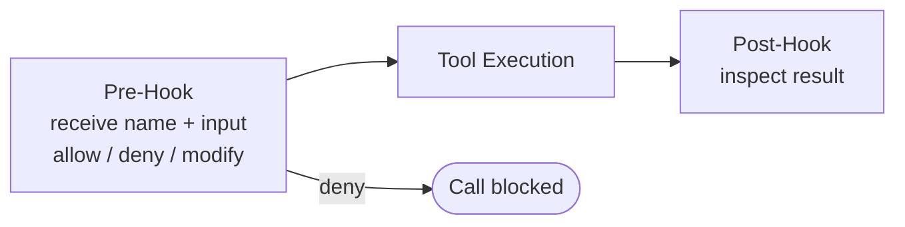
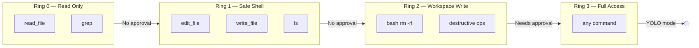

# Building Jugari: A Coding Agent Harness

> Resource: [What is an Agent Harness? and How to build a great one!](https://www.youtube.com/watch?v=nWzXyjXCoCE)
>
> Project name: [Jugari — why?](../Decisions/name-choice.md)

## Contents

- [What even is a Harness?](#what-even-is-a-harness)
  - [Modern LLM](#modern-llm)
  - [Harness](#harness)
  - [Good Examples](#good-examples)
  - [Frameworks vs Harness](#frameworks-vs-harness)
- [Nine Components inside a Harness](#nine-components-inside-a-harness)
  1. [While Loop](#1-while-loop)
  2. [Context Management](#2-context-management)
  3. [Skills & Tools](#3-skills--tools)
  4. [Sub-Agents](#4-sub-agents)
  5. [Built-in Skills](#5-built-in-skills)
  6. [Session Persistence](#6-session-persistence)
  7. [System Prompt Assembly](#7-system-prompt-assembly)
  8. [Lifecycle Hooks](#8-lifecycle-hooks)
  9. [Permissions & Safety](#9-permissions--safety)
- [Pre-Development Decisions](../Decisions/pre-development-decisions.md)

---

## What even is a Harness?

A Harness is a fixed **Architecture** that turns a **Model** into an **Agent**.

---

### Modern LLM

These are just one-shot text generators. You ask a question, it answers, and then stops.

### Harness

A harness gives them the ability to take action, see consequences, and keep going until the goal is achieved or the problem is solved.

> **Analogy:** Consider the **Model** as the engine and the **Harness** as the car — together they combine to form an **Agent**.

### Good Examples

Good examples are **agentic** coding tools such as:

- Cursor
- Codex
- Windsurf
- OpenCode

> They all use remarkably similar architecture — more on that later.

### Frameworks vs Harness

Popular framework names:

- LangChain
- LangGraph
- AutoGen
- CrewAI

**These are not harnesses.** That is an important distinction — terms like orchestration, framework, harness, agent, graph, runtime, and loop often get used interchangeably and nobody really seems to agree.

---

#### Clear distinction between Framework & Harness

A framework gives you abstraction. A human architect has to wire together multiple pieces and there are many ways to do that.

A harness is the opposite — it ships pre-wired. It is basically a while loop, tool registry, permissions — all pre-wired.

**Another way to look at it:**

| Framework         | Harness             |
| ----------------- | ------------------- |
| Built for a human | Built for the agent |

> You provide the goal and the harness handles the rest.

From here on, we focus on the harness.

---

## Nine Components inside a Harness

1. While Loop
2. Context Management
3. Skills & Tools
4. Sub-Agents
5. Built-in Skills
6. Session Persistence
7. System Prompt Assembly
8. Lifecycle Hooks
9. Permissions & Safety

> This is an **opinionated architecture**, not gospel.

We will tie everything to Claude Code as a reference example.

### 1. While Loop

> The foundation

It is the outer iteration loop. At its core, a harness is a while loop. It reads its system prompt, decides which tool to call, runs the tool, feeds the output back into the context, and loops again. It continues until a text-only response is made or it reaches the maximum iteration cap.

> Think of this outer loop as the engine that runs everything.

### 2. Context Management

> What to keep — summarize — drop

On every turn, the context grows larger. The harness decides what to keep, summarize, and throw away.

For Claude Code, the budget (context) used to be 200K, now up to 1M for Opus. When reaching a certain limit (say 80%), it triggers a compaction that smartly summarizes the previous context, keeps some of the most recent messages, then discards the rest.

This can be very bad if not handled carefully and can have real consequences.

> Agent forgets silently — failure of compaction.

### 3. Skills & Tools

> Primitives below — markdown above — registry between

#### Layers

1. **Tools — Primitives — Universal**  
   These are `read_file`, `edit_file`, `bash`, and `search`. Tools are universal.

2. **Skills — Markdown — Team-Specific**  
   Skills are just `.md` files that describe how to perform a specific specialized task. These are team-specific.  
   *Example:* a frontend developer will have a `UI_UX_MAX.md` skill, but the backend developer will have a `backend_design.md` skill.

3. **Registry**  
   This is what actually provides the LLM with what tool/skill is available, with what permissions, and how/when to use them.

### 4. Sub-Agents

> When a task gets too big — parallel work — isolated sessions

When a task gets too big for a single chat thread, the harness creates a sub-agent that works in its own session. Each sub-agent gets an isolated session, its own restricted set of tools, and a focused system prompt.

Main idea: **Spawn → Restrict → Collect**

### 5. Built-in Skills

> What every harness ships with — out of the box

These are a non-negotiable set of skills necessary for the harness to function. They mostly include primitives like read, write, bash (shell), grep, and glob. There is no coding agent without these.

Apart from primitives, a harness can also ship with additional skills depending on the vendor and the use case. This is where different harnesses compete.

### 6. Session Persistence

> Memory — survive the crash — resume exactly

If a harness does not update the state of a session elegantly (using some db, yaml file, or anything written to disk), a crash will make it forget everything.

Modern harnesses handle this elegantly. They use various file formats like append-only JSON files (JSONL) or markdown files. Every message, event, tool call, and compaction gets one line in the record. This lets you resume exactly where you left off.

### 7. System Prompt Assembly

> Not a string — a pipeline — stitched per project

The system prompt is not a static string — it's a pipeline. It can inject specific files like `AGENTS.md` or `CLAUDE.md` into the system prompt itself.

This needs to be very careful: dynamic above static breaks prefix caching. Order matters. When inserting dynamic content into a system prompt, the static part should always be at the top.

### 8. Lifecycle Hooks

> The extensibility seam — pre — post — allow — deny — modify

Hooks let you inject custom logic before or after a tool run without touching the harness itself. A pre-hook fires before tool execution — it receives the tool name and input, and can allow, deny, or modify the call. A post-hook triggers after the tool call finishes and can inspect the result.

### 9. Permissions & Safety

> Read-only — workspace-write — full — interactive approval

This is what differentiates a dangerous tool from a safe one. Modern harnesses define a hierarchy of permission modes. Each tool declares the permission level it requires.

It is like a kernel ring of security, but for the model that the harness enforces. Every tool has its permission level required to be executed.

**Examples:**

- **Ring 0** — Safe, read-only — tools: `read_file`, `grep`
- **Ring 1** — Safe shell commands, classified as read-only — tools: `edit_file`, `bash - ls`, `write_file`
- **Ring 2** — Workspace-write, classified as full — tools: `bash - rm -rf` → needs approval  
  Static approval + human in the loop. The harness also has model-weight for user approval.
- **Ring 3** — YOLO / full access

This is at least the basics of it.

---

## Pre-Development Decisions

> Moved to [Decisions/pre-development-decisions.md](../Decisions/pre-development-decisions.md)
